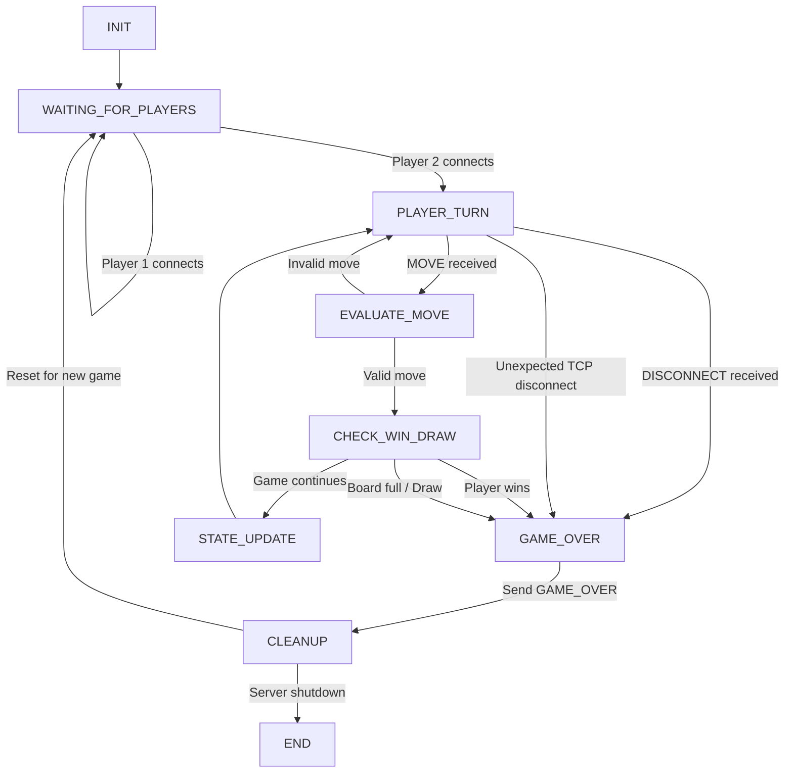

```mermaid
flowchart TD
    A[INIT] --> B[WAITING_FOR_PLAYERS]

    B -->|Player 1 connects| B
    B -->|Player 2 connects| C[PLAYER_TURN]

    C -->|MOVE received| D[EVALUATE_MOVE]
    C -->|DISCONNECT received| G[GAME_OVER]
    C -->|Unexpected TCP disconnect| G

    D -->|Invalid move| C
    D -->|Valid move| E[CHECK_WIN_DRAW]

    E -->|Player wins| G
    E -->|Board full / Draw| G
    E -->|Game continues| F[STATE_UPDATE]

    F --> C

    G -->|Send GAME_OVER| H[CLEANUP]

    H -->|Reset for new game| B
    H -->|Server shutdown| I[END]
```
