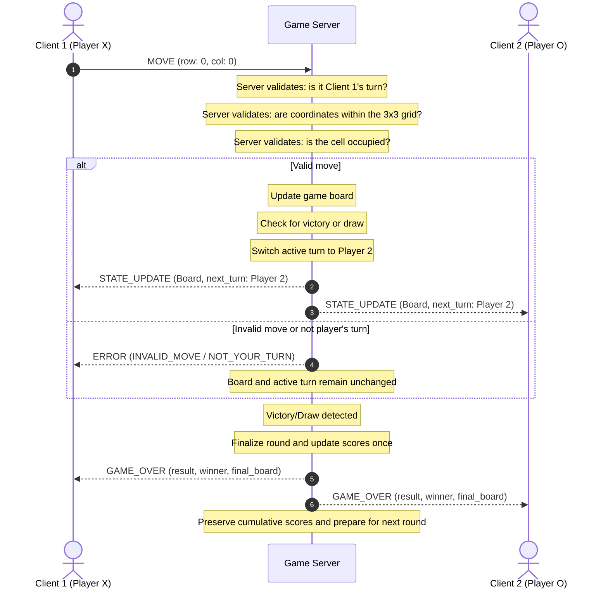

```mermaid
sequenceDiagram
    autonumber
    actor Client1 as Client 1 (Player X)
    participant Server as Game Server
    actor Client2 as Client 2 (Player O)

    Client1->>Server: MOVE (row: 0, col: 0)
    Note over Server: Server validates: is it Client 1's turn?
    Note over Server: Server validates: are coordinates within the 3x3 grid?
    Note over Server: Server validates: is the cell occupied?
    alt Valid move
        Note over Server: Update game board
        Note over Server: Check for victory or draw
        Note over Server: Switch active turn to Player 2
        Server-->>Client1: STATE_UPDATE (Board, next_turn: Player 2)
        Server-->>Client2: STATE_UPDATE (Board, next_turn: Player 2)
        
    else Invalid move or not player's turn
        Server-->>Client1: ERROR (INVALID_MOVE / NOT_YOUR_TURN)
        Note over Server: Board and active turn remain unchanged
    end

    Note over Server: Victory/Draw detected
    Note over Server: Finalize round and update scores once
    Server-->>Client1: GAME_OVER (result, winner, final_board)
    Server-->>Client2: GAME_OVER (result, winner, final_board)
    Note over Server: Preserve cumulative scores and prepare for next round
```
